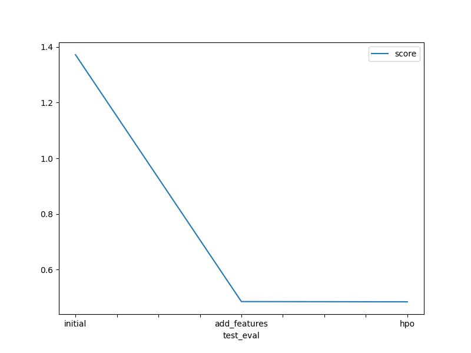

# Report: Predict Bike Sharing Demand with AutoGluon Solution
#### Abdelhaq KHARROU

## Initial Training
### What did you realize when you tried to submit your predictions? What changes were needed to the output of the predictor to submit your results?
No model performed well because data was not featured engineer. I had no errors because I removed negative values from my predictions

### What was the top ranked model that performed?
WeightedEnsemble_L3	-101.239141	6.601504	542.645284	0.002633	1.213805	3	True	20

## Exploratory data analysis and feature creation
### What did the exploratory analysis find and how did you add additional features?
I found that the datetime was a string, I converted to a datetime to extract further informations from it (year, month, day, hour). Also I converted weather and season to category as It was a number.

### How much better did your model preform after adding additional features and why do you think that is?
0	WeightedEnsemble_L3	-34.720092	15.614413	467.853521	0.001440	1.036451	3	True	19
Engineered features are more descriminating and informative data. So,  seperate datetime into more granular data, provided more seasonal varioations, also creating categorical features yielded qualitative info.

## Hyper parameter tuning
### How much better did your model preform after trying different hyper parameters?
0	WeightedEnsemble_L3	-34.875850	15.943003	493.817281	0.001712	1.488869	3	True	19
Model didn't perform too much, as this needs more trial and error, and more time.

### If you were given more time with this dataset, where do you think you would spend more time?
I will spend time trying to understand data, like holiday column, temp and engineer more features as this has brought more improvements in my previous work. Hyperparameters would be a good idea too, however I dnotice slight improvements( Kaggle scores: 0.48512, 0.4842)

### Create a table with the models you ran, the hyperparameters modified, and the kaggle score.
|model|hpo1|hpo2|hpo3|score|
|--|--|--|--|--|
|initial|default_hps|default_hps|default_hps|1.37226|
|add_features|default_hps	|default_hps	|default_hps	|0.48512	|
|hpo|NN: dropou_prob(0, 0.5) num_epochs (30, 40)|GBM_num_leaves*num_boost_round (70, 10000)|hps_num_trials: 100|0.4842|

### Create a line plot showing the top model score for the three (or more) training runs during the project.

TODO: Replace the image below with your own.

### Create a line plot showing the top kaggle score for the three (or more) prediction submissions during the project.

TODO: Replace the image below with your own.

## Summary
I have the chance to apply the knowledge acquired in this course. By utilizing quality data, conducting effective data engineering, and employing a model with default hyperparameters, I can achieve excellent results.